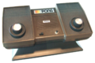
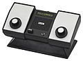
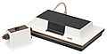

# **Consolas**

 

## *Primera Generación*

 

Si bien los primeros juegos de computadora aparecieron en la década de los 1960, éstos utilizaban pantallas vectoriales, no de vídeo analógico. No fue hasta 1972 cuando se lanzó la primera videoconsola de sobremesa por la compañía electrónica Magnavox.1​ La Magnavox Odyssey, fue creada por Ralph Baer, considerado como el padre de los videojuegos.2​ La Odyssey tuvo un moderado éxito, sin embargo, con el lanzamiento del juego arcade Pong de Atari, comenzaron a popularizarse los videojuegos, el público comenzó a mostrar interés ante la nueva industria. En el otoño de 1975, la compañía Magnavox, cede ante la popularidad del Pong, se cancela el proyecto Odyssey, ya que el público solo jugaba al Pong y Hockey en la Odyssey 100.

 

 

 

 

- [Regresar...](index.md)

 

- ##### Información tomada como práctica del siguiente enlace: <a href= "https://es.wikipedia.org/wiki/Videoconsola#Primera_generaci%C3%B3n"> Wikipedia.

