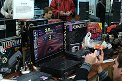

# Consolas y Juegos

 

## Menú

[Consolas](./about.md)  
[Juegos de Nueva Generación](./services.md)  

 

## Un poco de Historia

 

Una video consola o consola de video juegos es un sistema electrónico de entretenimiento que ejecuta videojuegos contenidos en cartuchos, discos ópticos, discos magnéticos, tarjetas de memoria o cualquier dispositivo de almacenamiento.

 

Los primeros sistemas de videoconsolas fueron diseñados únicamente para jugar videojuegos pero a partir de la quinta generación de videoconsolas han sido incorporadas características importantes de multimedia, internet, tiendas virtuales y servicio en línea como: Nintendo Switch Online, PlayStation Network, y Xbox Network.

 

Una videoconsola es un pequeño sistema electrónico que está diseñado para ejecutar juegos desarrollados en una computadora o servidor. Al igual que las computadoras, pueden adoptar diferentes formas y tamaños; de este modo, pueden ser de sobremesa, es decir, requieren ser conectadas a un televisor para la visualización del videojuego, y a la red eléctrica para su alimentación, en la cual suelen consumir 12 voltios, o bien el dispositivo electrónico videoconsola portátil, que cuenta con una pantalla de visualización integrada y una fuente de alimentación propia (baterías o pilas).

 

##### Información tomada como práctica del siguiente enlace: <a href= "https://es.wikipedia.org/wiki/Videoconsola"> Wikipedia.

