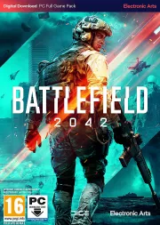
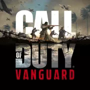
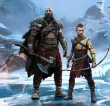

# **Juegos de Nueva Generación**

## *Battlefield 2042*

 

Battlefield 2042 lleva la legendaria saga de shooters militares de Electronic Arts y DICE a un futuro cercano. Diseñado como "una nueva generación" para la saga, el videojuego está construido sobre una versión modernizada del característico motor gráfico Frostbite para sacar partido al hardware de PC, Xbox Series X|S y PlayStation 5 con partidas de hasta 128 jugadores en los mayores mapas vistos hasta la fecha, y con versiones reducidas para 64 personas en PS4 y Xbox One.

 

Battlefield 2042 ambienta su acción en un futuro cercano transformado por el desorden, en el que la humanidad se enfrenta a la mayor crisis de su historia, con una gran escasez de recursos, con Estados Unidos y Rusia al borde de la guerra y con pueblos enteros sin una nación a la que llegar hogar. Hasta este mundo ha de viajar el jugador, en concreto tomando el rol de un grupo de soldados despatriados con habilidades únicas que han tomado las armas y que cumplen diferentes misiones.

 

## *Call of Duty Vanguard*

 

Call of Duty: Vanguard lleva de vuelta la saga de acción bélica de Activision a la Segunda Guerra Mundial, invitando al jugador a ser testigo de los orígenes de las Fuerzas especiales mientras desempeña un papel fundamental y cambia la faz de la historia en una apasionante Campaña en cuatro grandes escenarios de guerra. Todo ello sin olvidar el multijugador, que regresa un año más cargado de ritmo e innovación con 20 mapas disponibles de lanzamiento, y un modo Zombies que apuesta por un crossover que expande el universo. Firmado por Sledgehammer Games, COD: Vanguard se puede jugar en PC (Battle.net), PS5, PS4, Xbox Series X|S y Xbox One.

 

## *God of War: Ragnarok*

 

God of War: Ragnarok es el nombre por el que actualmente conocemos la segunda entrega de la nueva saga de Kratos desarrollada por el equipo de Cory Barlog en Sony Santa Monica. Por ahora no se ha facilitado muchos detalles, pero sí se promete llevarnos hasta el Ragnarok.

De momento no se han compartido apenas información sobre este God of War 2 que llevará de nuevo a Kratos y compañía a combatir por tierras nórdicas tras el buen recibimiento de la primera entrega, pero sí puede esperarse varios avances para aprovechar las bondades de PlayStation 5, sacando partido a los gatillos adaptables y retroalimentación háptica del mando DualSense.

El desarrollo de God of War: Ragnarok empezó poco después del lanzamiento del exclusivo de PS4, habiendo habido varios reportes sobre fichajes de personales para este proyecto desde entonces. El videojuego, además, será de carácter intergeneracional, llegando a PlayStation 4 además de PS5 en una fecha aún por determinar del 2022.

 

- [Regresar...](index.md)

 

- ##### Información tomada como práctica del siguiente enlace: <a href= "https://www.3djuegos.com/37588/god-of-war-ragnarok/"> 3dJuegos.

